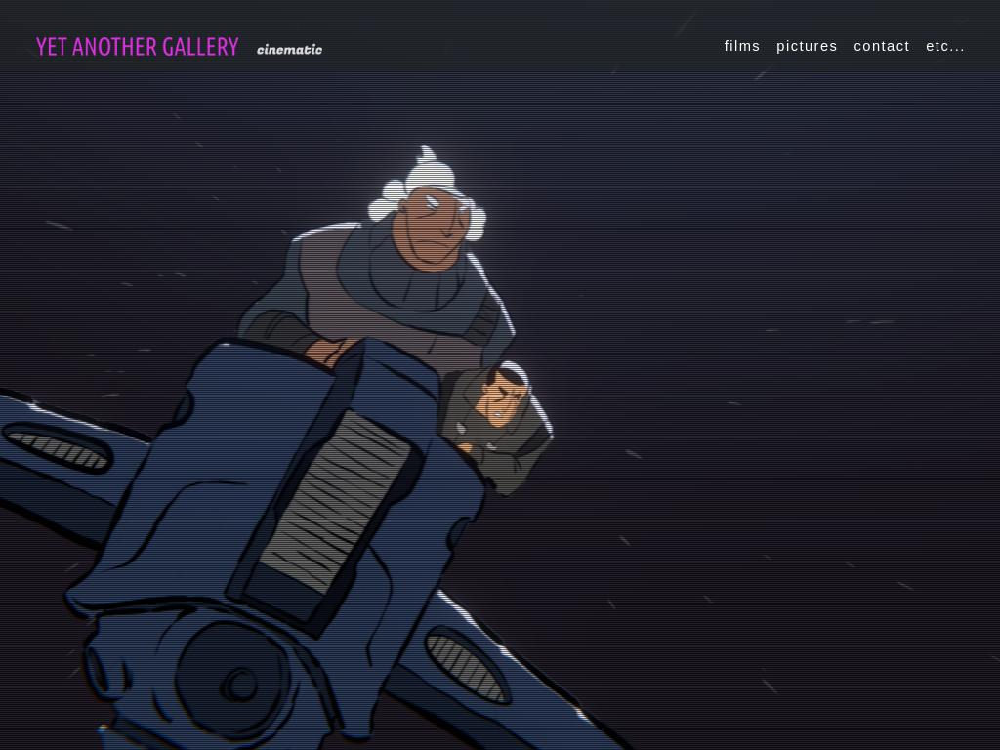

# Yet Another Gallery - Cinematic

Quiqr template based for stylish video or photo galleries.

[Checkout the demo](https://mipmip.github.io/quiqr-yet-another-gallery-template/)!

## about

The CMS in Quiqr features editing all menu items, text and images and easily lets you change the design.

- Supports Vimeo and youtube popup's
- Popups for images
- Custom fonts, custom colors
- Frontpage with slideshow

## Showcase

- [Pim Hawinkels - cinematographer](https://pimhawinkels.com)

## 👏 Special Thanks 
- [Blender Studio](https://studio.blender.org/) - Provider of beautiful demo material
- [Unsplash](https://www.unsplash.com) for supplying _free_ stock photos.
- [Jay Salvat](https://vegas.jaysalvat.com) - Author of the VegasJS Slideshow
- [Dmitry Semenov](https://dimsemenov.com/plugins/magnific-popup/) - Author of the Magnific Popup plugin.
